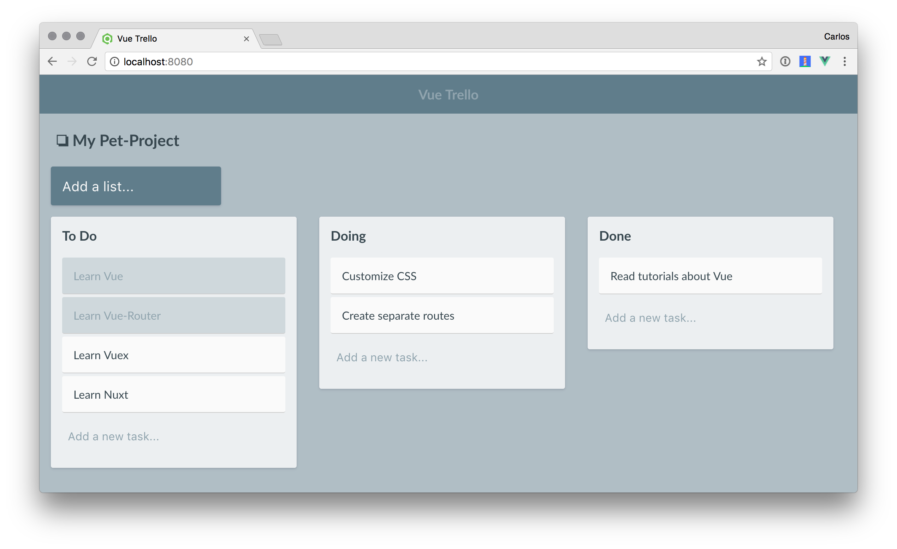

# vue-trello

> Trello clone with Vue and Vuex



## Features
* Vue.js v2
* Vuex v2
* Manage state with actions and mutations
* Getters to manage partial state in Components
* Scoped styles with Sass/SCSS
* User can create multiple boards, lists and tasks
* Vue-Router to show differents boards

## ToDos
* Persistence with Firebase
* User authentication
* Create Vuex modules when the app grow with new features
* Lazy loading modules in Vuex and Route based components

## Build Setup

``` bash
# install dependencies
npm install

# serve with hot reload at localhost:8080
npm run dev

# build for production with minification
npm run build

# build for production and view the bundle analyzer report
npm run build --report
```

For detailed explanation on how things work, checkout the [guide](http://vuejs-templates.github.io/webpack/) and [docs for vue-loader](http://vuejs.github.io/vue-loader).
